# Fragments – Lab 1 Setup (CCP555)

A Node.js/Express microservice scaffold with proper tooling (Prettier, ESLint), structured logging (Pino), a health-check route, and npm scripts for local dev + debugging.

**Author:** Diba Makki  
**Repo:** https://github.com/dibamackie/fragments

## What I Set Up

- GitHub repo and SSH
- Development environment on Windows (with PowerShell and curl.exe)
- Node.js (LTS), VS Code, Git CLI
- Project initialization (`npm init -y`)
- Prettier + ESLint (flat config) with auto-format on save
- Express app with middleware: **helmet**, **cors**, **compression**
- **Pino** structured logging with pretty output in `debug` mode
- Health-check route at `/`
- npm scripts: `start`, `dev`, `debug`, `lint`
- VS Code launch config for attaching a debugger

---

## Prerequisites

- Node.js ≥ **20.6** (I’m using Node 24)
- npm (bundled with Node)
- VS Code (extensions: **ESLint**, **Prettier – Code Formatter**, **Code Spell Checker**)
- Git CLI
- PowerShell tip: use **`curl.exe`** (not `curl`) to avoid alias issues

---

## Install & Run

```bash
# clone
git clone git@github.com:dibamackie/fragments.git
cd fragments

# install dependencies
npm install

# create development env file
echo LOG_LEVEL=debug > debug.env   # PowerShell: echo LOG_LEVEL=debug > debug.env

```
## Scripts
```bash
{
  "scripts": {
    "test": "echo \"Error: no test specified\" && exit 1",
    "lint": "eslint \"./src/**/*.js\"",
    "start": "node src/server.js",
    "dev": "node --env-file=debug.env --watch ./src/server.js",
    "debug": "node --env-file=debug.env --inspect=0.0.0.0:9229 --watch ./src/server.js"
  }
}
```

## Run:
```bash
npm start           # normal
npm run dev         # watch + debug.env
npm run debug       # watch + inspector on 9229 (for VS Code)
npm run lint        # lint all src/*.js
```

## Health Check & Headers
With the server running:
```bash
curl.exe -i http://localhost:8080
```

Expected JSON (example):
```bash
{
  "status": "ok",
  "author": "Diba Makki",
  "githubUrl": "https://github.com/dibamackie/fragments",
  "version": "0.0.1"
}
```

## Pretty print (if you have jq):
```bash
curl.exe -s http://localhost:8080 | jq
```
Helmet, CORS, and cache headers are included (look for Cache-Control: no-cache and Access-Control-Allow-Origin: *).

## Tooling
Prettier
- Config: .prettierrc
- Ignore: .prettierignore
- Auto-format on save via .vscode/settings.json.

Format everything:
```bash
npx prettier . --write
``` 
ESLint
```bash
Flat config at eslint.config.mjs using Node globals + @eslint/js recommended rules.
npm run lint
# or
npx eslint "./src/**/*.js" --fix
```

## Structured Logging (Pino)

- src/logger.js uses LOG_LEVEL (e.g., debug in debug.env).
- In debug level, logs are prettified via pino-pretty.

## Project Structure

| Path | Description |
|------|-------------|
| `.vscode/settings.json` | VS Code settings |
| `.vscode/launch.json` | VS Code debug configuration |
| `src/app.js` | Express app & routes (health check at '/') |
| `src/logger.js` | Pino logger (structured logging) |
| `src/server.js` | Server bootstrap with stoppable() |
| `debug.env` | Local dev variables (LOG_LEVEL=debug) |
| `eslint.config.mjs` | ESLint configuration |
| `package.json` | Project dependencies |
| `package-lock.json` | Dependency lock file |
| `Lab1-Screenshots/` | Screenshots for this README |
| `README.md` | Project documentation |

## VS Code Debugging
.vscode/launch.json:
```bash
{
  "version": "0.2.0",
  "configurations": [
    {
      "name": "Debug via npm run debug",
      "request": "launch",
      "cwd": "${workspaceFolder}",
      "runtimeExecutable": "npm",
      "runtimeArgs": ["run-script", "debug"],
      "skipFiles": ["<node_internals>/**"],
      "type": "node"
    }
  ]
}
```

Set a breakpoint in src/app.js (e.g., on the health-check res.status(200).json(...)), start Debug in VS Code, then request http://localhost:8080.


## Screenshots (Step-by-Step)

### SSH key
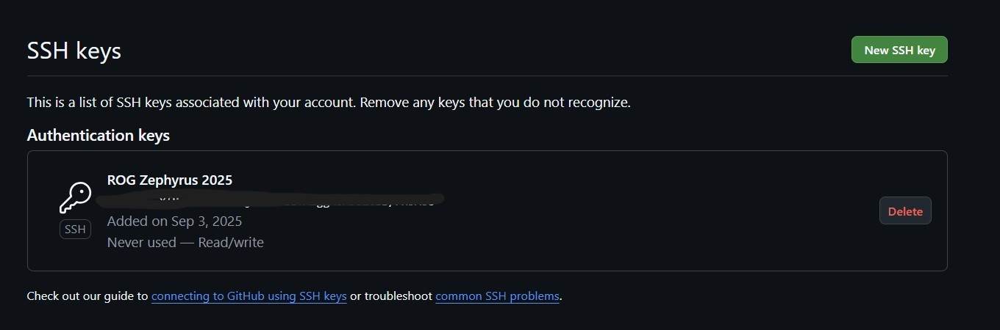  

### WSL
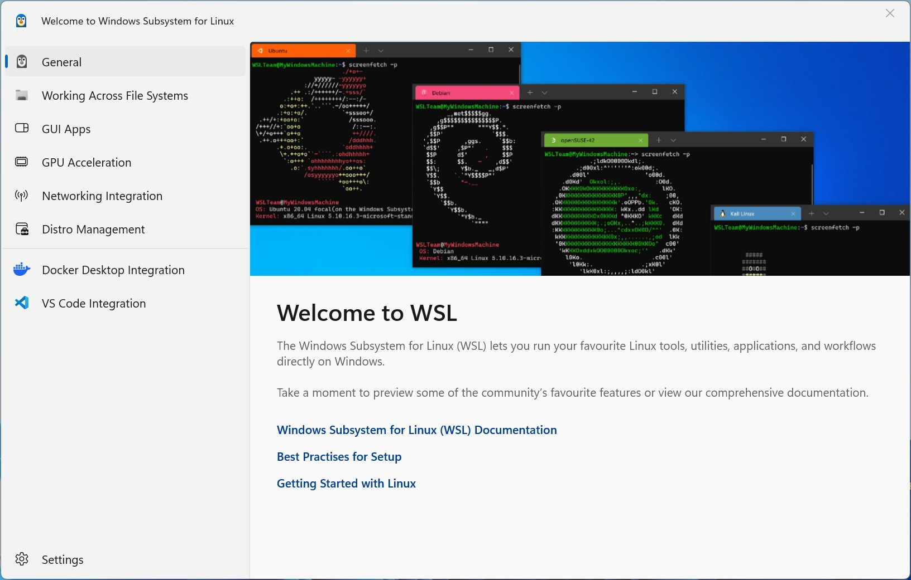  

### Windows Terminal
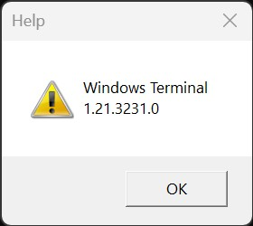  

### Node.js
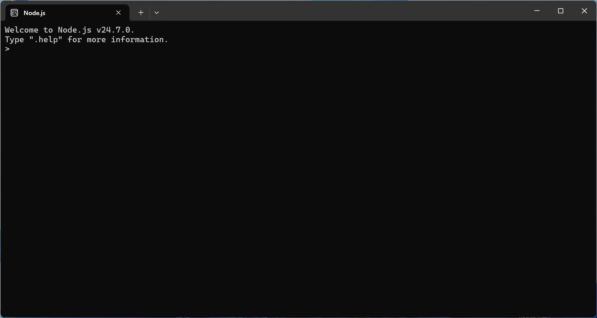  

### VS Code
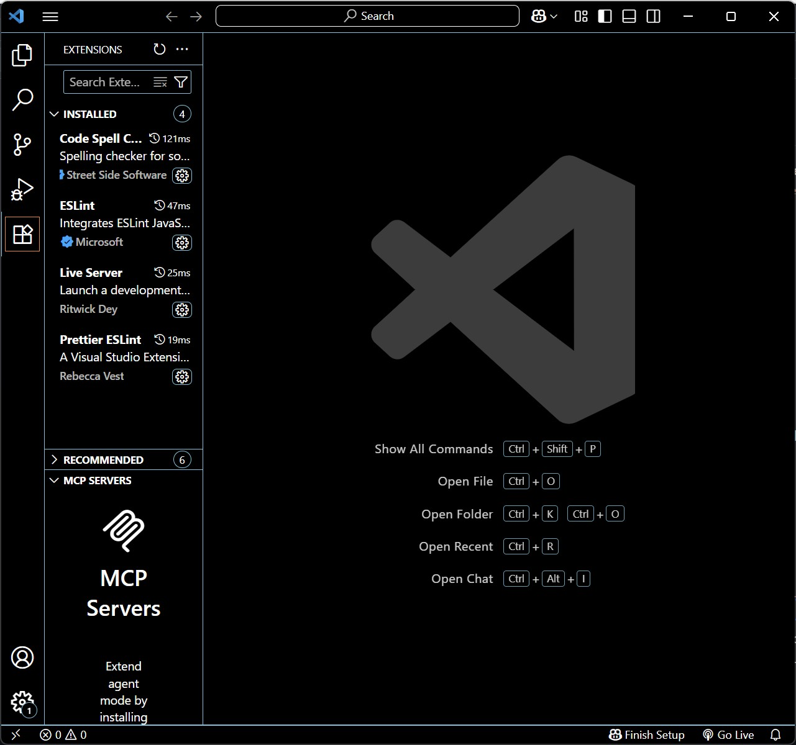  

### Git
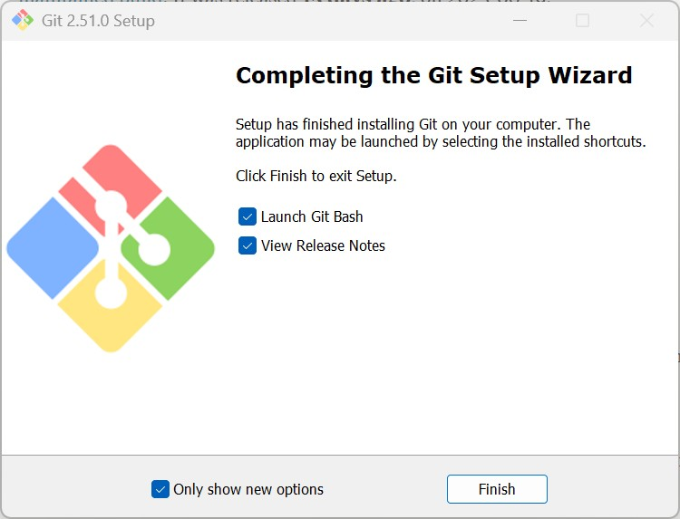  

### curl
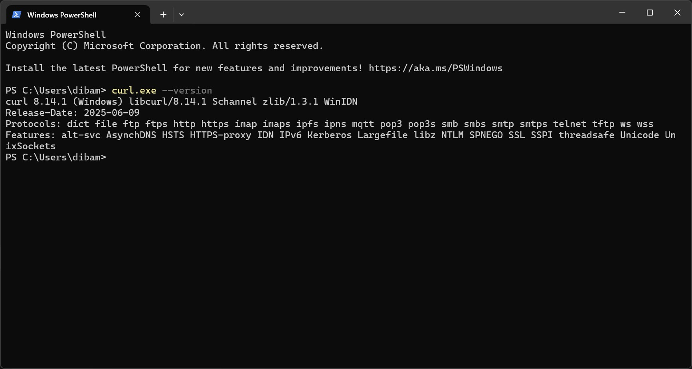  

### npm init
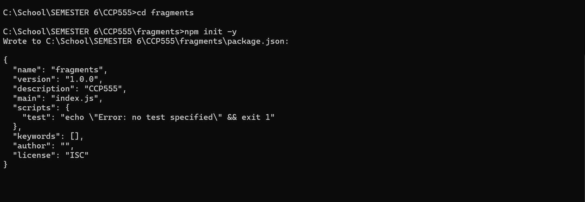  

### npm install
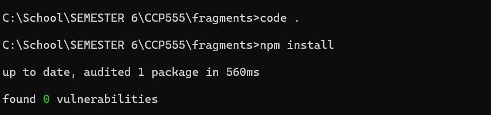  

### First git commit
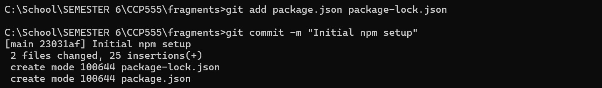  

### Install Prettier
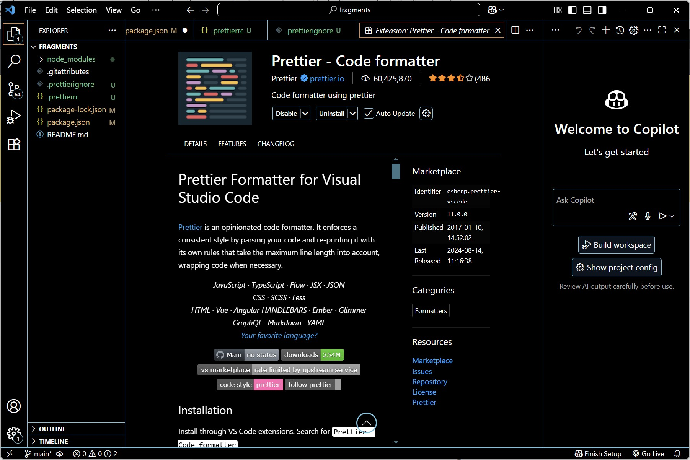  

### Prettier commit
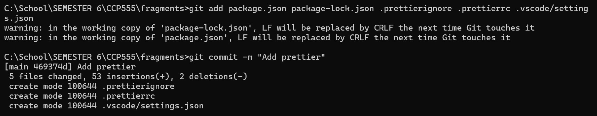  

### ESLint setup
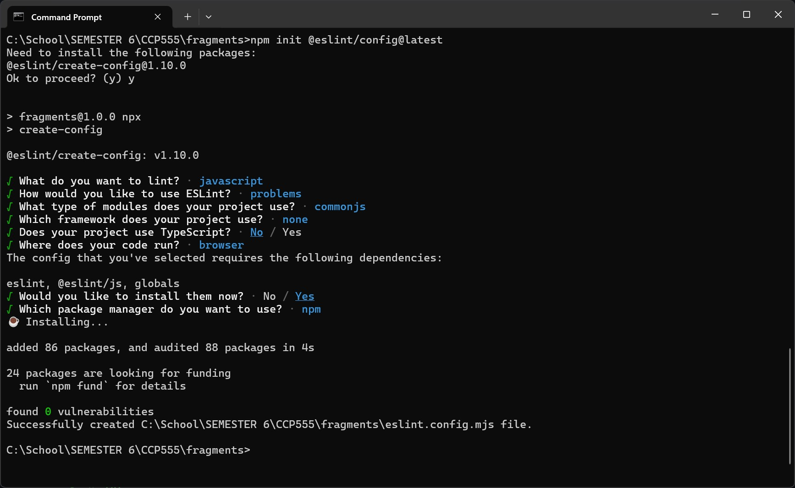  

### Pino
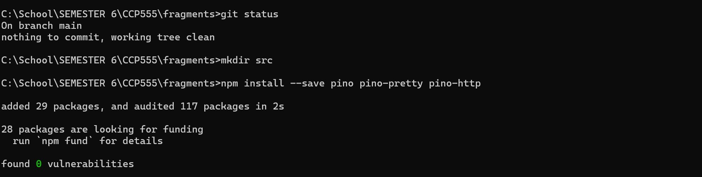  

### Express app setup
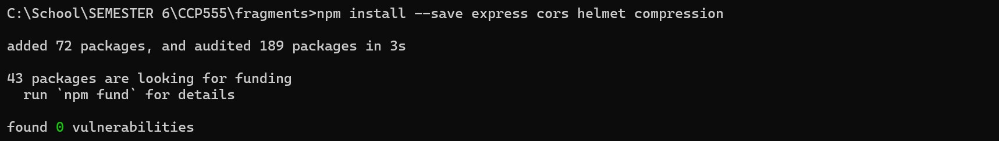  

### Express server setup
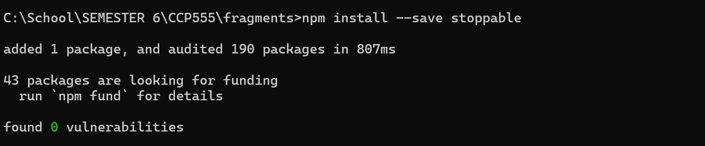  

### ESLint bug fixed + test server
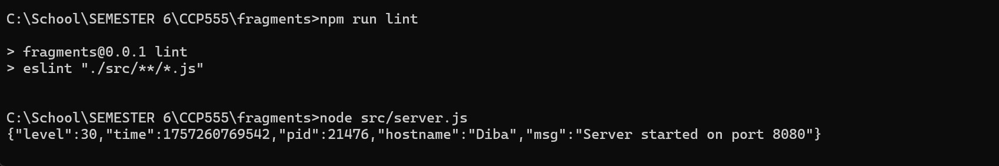  

### Test server (terminal)
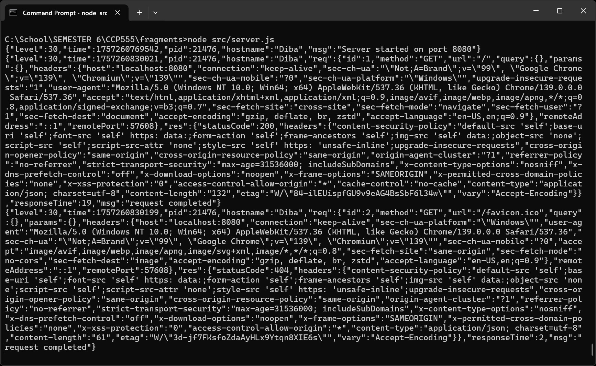  

### Test server (browser)
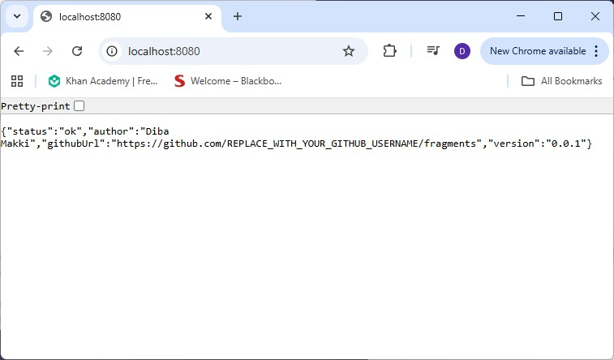  

### Confirmation
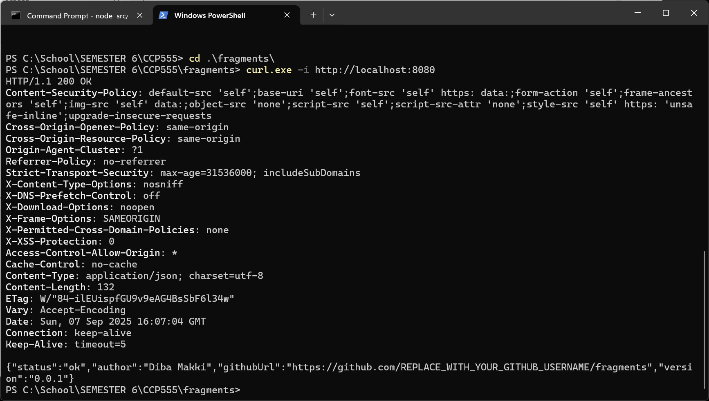  

### npm start
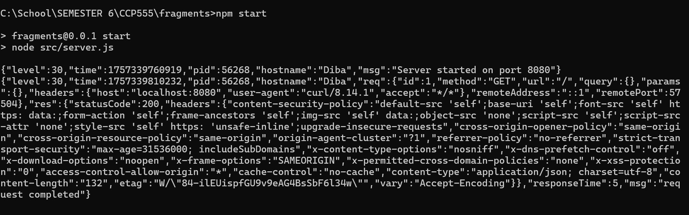  

### Health check (terminal)
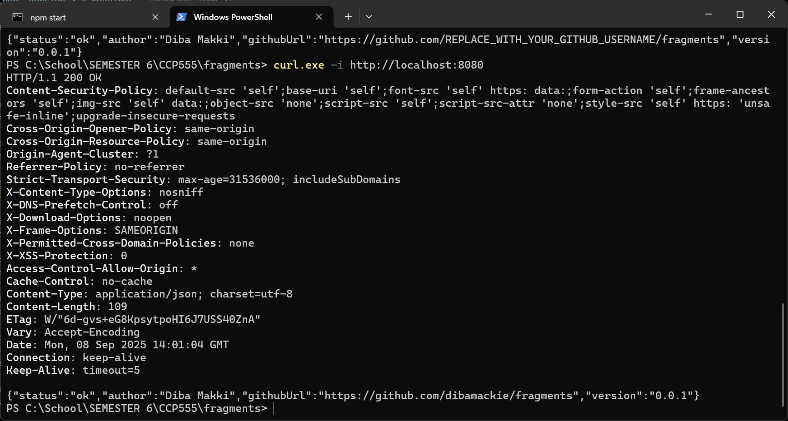  

### Health check (browser)
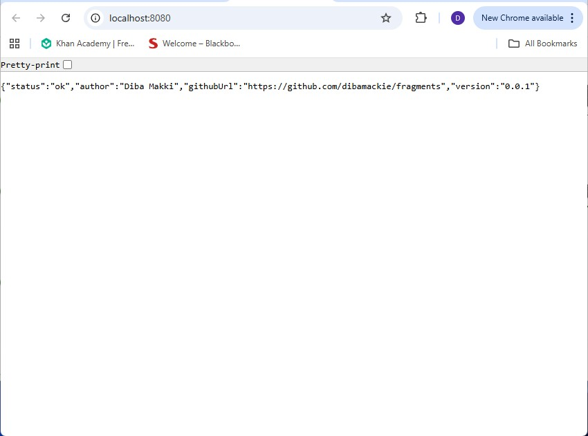  


